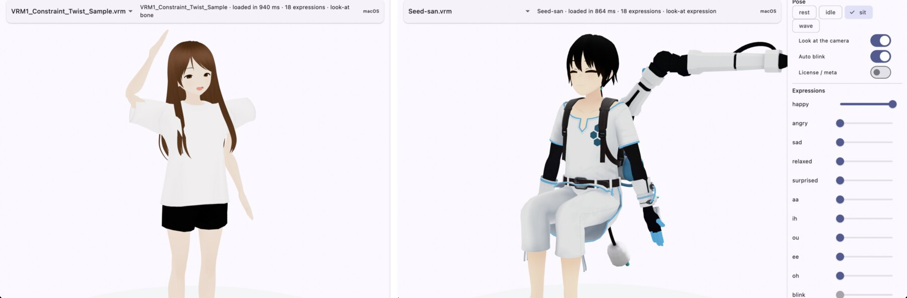

# flutter_vrm

[](https://github.com/kiarina/flutter_vrm/actions/workflows/ci.yml)
[](LICENSE)

**English** | [日本語](README.ja.md)

VRM 1.0 avatars for Flutter, rendered by [flutter_scene](https://pub.dev/packages/flutter_scene)
(Flutter GPU / Impeller, with a WebGL2 backend on the web).



## Summary

flutter_scene already imports glTF with skinning, morph targets, and PBR materials, and it
renders on iOS, Android, macOS, Windows, Linux, and the web from one Dart codebase. What it
does not know is VRM: it reads a `.vrm` file as plain glTF and skips the `VRMC_*`
extensions. flutter_vrm reads those extensions from the same bytes and drives the imported
model the way VRM describes it: humanoid bones, expressions, look-at, and blinking.

> [!NOTE]
> flutter_vrm is at an early stage (`0.1.0-dev`). APIs may change, and it is not on pub.dev yet.

## Features

- **Load** a VRM 1.0 file into a flutter_scene `Node` with `VrmAvatar.fromBytes`
- **Meta**: name, authors, license and usage permissions (`VrmMeta`)
- **Humanoid**: pose the body with *normalized* bone rotations (model space, relative to the
  T-pose), so one pose works on any VRM 1.0 model whatever its bones' own axes
- **Expressions**: presets and custom expressions, `isBinary`, the blink / look-at / mouth
  overrides, morph target binds, material color binds (`color`, `emissionColor`), and texture
  transform binds
- **Look-at**: both `bone` (eye bones) and `expression` (lookUp/Down/Left/Right) types, with
  the model's range maps
- **MToon**: `VRMC_materials_mtoon` materials render with an MToon 1.0 shader (shade color,
  shading shift and toony, emission, matcap, parametric rim, UV animation, alpha modes,
  double-sided, normal maps, and outlines). It ships compiled with the package; apps need no
  extra build step
- **SpringBone**: `VRMC_springBone` chains (hair, clothes) sway with stiffness, gravity, and
  drag, and collide with sphere and capsule colliders. They follow the avatar through the
  world (move or turn `avatar.root` and they swing), and gravity stays world-down when the
  avatar lies down
- **Node constraints**: `VRMC_node_constraint` roll, aim, and rotation constraints (twist
  bones, sleeves that follow the arms)
- **VRM Animation**: play `.vrma` files (`VrmAnimation`, `VrmAnimationPlayer`) on any VRM 1.0
  model: humanoid rotations (retargeted through normalized rotations, bones the model lacks
  folded into their children), the hips translation scaled to the model, expressions, and
  look-at
- **Hit testing**: `avatar.hitTest(ray)` tells which body part a tap hit, with capsules that
  follow the posed humanoid bones (a sitting or lying avatar is hit where it is drawn)
- **Auto blink**
- **Renderer-independent parser**: `package:flutter_vrm/vrm_schema.dart` reads GLB and VRM 1.0
  without touching flutter_scene

Not yet: first-person settings and VRM 0.x files. MToon's render queue offsets are ignored (flutter_scene sorts translucent
surfaces by depth).

MToon reads its light from `avatar.mtoonLighting` rather than the scene, because flutter_scene's
custom materials cannot read scene lights yet. Call `avatar.mtoonLighting.fromScene(scene)`
each frame to follow the scene's directional light. Global illumination is a sky / ground
ambient pair (`skyColor`, `groundColor`) instead of the environment map, and MToon surfaces do
not receive shadow maps. Outlines are drawn as an inverted hull; the outline width texture
works as a mask (width is either the full factor or none), because flutter_scene's custom
materials can sample textures only in the fragment stage. Pass the camera to
`avatar.update(dt, camera: camera)` so outlines sized in screen coordinates follow its field
of view.

## Quick Start

flutter_vrm needs Flutter 3.47 or newer and flutter_scene's setup (Flutter GPU enabled per
platform and `dart run flutter_scene:init`); see the
[flutter_scene README](https://pub.dev/packages/flutter_scene).

```yaml
dependencies:
  flutter_scene: ^0.23.0
  flutter_vrm:
    git:
      url: https://github.com/kiarina/flutter_vrm
```

```dart
import 'package:flutter/services.dart';
import 'package:flutter_scene/scene.dart';
import 'package:flutter_vrm/flutter_vrm.dart';
import 'package:vector_math/vector_math.dart';

final scene = Scene();
final data = await rootBundle.load('assets/avatar.vrm');
final avatar = await VrmAvatar.fromBytes(data.buffer.asUint8List());
scene.add(avatar.root);

// Pose: sit down (model space: +X is the model's left, +Y up, +Z forward).
avatar.humanoid
  ..setNormalizedRotation(
      VrmHumanBone.leftUpperLeg, Quaternion.axisAngle(Vector3(1, 0, 0), -1.57))
  ..setNormalizedRotation(
      VrmHumanBone.leftLowerLeg, Quaternion.axisAngle(Vector3(1, 0, 0), 1.57));

avatar.expressions.setPreset(VrmExpressionPreset.happy, 0.8);
avatar.lookAt.target = camera.position;

// Every frame (for example in SceneView's onTick):
avatar.update(deltaSeconds, camera: camera);
```

To find what a tap hit, turn it into a ray and test the avatar. The avatar is tested with
capsules that follow its pose (head, torso, arms, hands, legs, feet); long hair and skirts
outside them are not hit. flutter_scene's own `Scene.raycast` tests skinned meshes in the
T-pose, so leave the avatar out of it and use it only for what may stand in front:

```dart
onTapUp: (details) {
  final ray = camera.screenPointToRay(details.localPosition, viewSize);
  final hit = avatar.hitTest(ray); // or VrmAvatar.hitTestAll(avatars, ray)
  final blocker = scene.raycast(ray, where: (n) => !avatar.contains(n));
  if (hit != null && (blocker == null || hit.distance < blocker.distance)) {
    print('tapped ${hit.bone?.name} at ${hit.point}');
  }
},
```

Adjust or disable parts through `avatar.hitShapes.capsules` (`radius`, `enabled`), and pass
`springColliders: true` to also test the model's spring bone colliders.

To play a VRM Animation, step a player before the avatar each frame:

```dart
final motion = await rootBundle.load('assets/wave.vrma');
final player = VrmAnimationPlayer(
  avatar,
  VrmAnimation.fromGlb(motion.buffer.asUint8List()),
);

// Every frame:
player.update(deltaSeconds);
avatar.update(deltaSeconds, camera: camera);
```

Move or turn the avatar through `avatar.root`. The model faces +Z in its own space, which
flutter_scene maps to -Z in the scene.

### Which flutter_scene

flutter_vrm compiles against the published flutter_scene 0.23 and its upstream `master`
(0.24 in progress), but is tested on `master` (MToon's compiled shaders included; if they
fail to load, avatars fall back to the imported glTF materials). This repository develops against a pinned `master` commit, which in our
measurements ran 2 to 3 times faster on Android. To do the same in your app, override both
packages from the same commit:

```yaml
dependency_overrides:
  flutter_scene:
    git:
      url: https://github.com/bdero/flutter_scene
      path: packages/flutter_scene
      ref: cff220e468ec1540071a1ff95067f5b474259b53
  scene:
    git:
      url: https://github.com/bdero/flutter_scene
      path: packages/scene
      ref: cff220e468ec1540071a1ff95067f5b474259b53
```

## Example

`example/` is a viewer: pick a model, orbit the camera, try poses, VRM Animations, and
expression sliders, toggle look-at, blinking, and spring bones, tap body parts (with the hit
capsules drawn), and read the model's license.

```sh
mise run fetch-samples      # downloads the sample models and animation
cd example
flutter run -d macos        # or ios, android, windows, chrome
```

Put your own `.vrm` and `.vrma` files in `example/assets/local/` (git-ignored) to see them
in the lists.

## Development

```sh
mise run          # format check, analyze, and test (package and example)
```

Tests build small VRM files in memory, so no model files are needed.

## Credits

The example downloads these models from
[vrm-c/vrm-specification](https://github.com/vrm-c/vrm-specification/tree/master/samples);
they are not included in this repository.

- Seed-san: Seed-san model by VirtualCast, Inc. ([VRM Public License 1.0](https://vrm.dev/licenses/1.0/))
- VRM1_Constraint_Twist_Sample: (c) 2022 pixiv Inc. ([VRM Public License 1.0](https://vrm.dev/licenses/1.0/))

The image above shows both samples in the example app. The example also downloads
`test.vrma` from [pixiv/three-vrm](https://github.com/pixiv/three-vrm) (MIT, (c) pixiv Inc.).

## License

[MIT](LICENSE)
